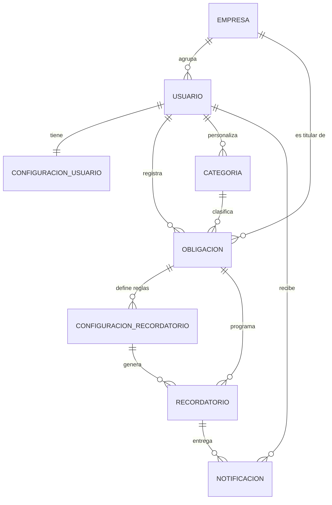

# PAYRECORD — Fase 0: Análisis y Arquitectura

> Documento de análisis previo a la implementación. Responde a los 13 puntos solicitados en
> la sección 42 de la especificación base.
>
> **Estado:** propuesta pendiente de aprobación. No se ha escrito código de la aplicación.
> **Fecha:** 2026-08-24

---

## 0. Verificación del entorno actual

Antes de proponer nada se revisó la máquina de desarrollo:

| Componente | Estado | Acción requerida |
|---|---|---|
| Carpeta `PayRecord/` | Existe, vacía | Ninguna |
| Python | **No instalado** | Instalar 3.12.x antes de la Fase 1 |
| pip | No disponible (viene con Python) | — |
| MySQL | **Servicio `MySQL80` en ejecución** | Solo crear la BD y el usuario |
| Git | 2.45.2 | Ninguna |
| Cliente `mysql` en PATH | No | Opcional (se puede usar MySQL Workbench) |

Esto convierte "instalar Python" en la primera tarea real de la Fase 1, y elimina el riesgo
de tener que instalar y configurar un motor de base de datos.

---

## 1. Arquitectura propuesta

### 1.1 Estilo arquitectónico

**Monolito modular en Django, patrón MVT + una capa de servicios explícita.**

No microservicios, no Docker, no Celery. Un solo proyecto Django, un solo despliegue, una
sola base de datos. La modularidad se consigue con apps Django bien delimitadas, no con
procesos separados.

### 1.2 Capas y responsabilidades

```
┌─────────────────────────────────────────────────────────────┐
│  PRESENTACIÓN                                                │
│  templates/ · static/ · views.py · urls.py · forms.py        │
│  Responsabilidad: recibir la petición, validar la entrada,   │
│  elegir el template. NO contiene reglas de negocio.          │
└──────────────────────────┬──────────────────────────────────┘
                           │
┌──────────────────────────▼──────────────────────────────────┐
│  NEGOCIO                                                     │
│  services/  → operaciones que ESCRIBEN o CALCULAN            │
│  selectors/ → consultas de solo lectura reutilizables        │
│  Aquí viven: cálculo de estado, algoritmo de prioridades,    │
│  generación de recordatorios, insights.                      │
│  Funciones puras siempre que sea posible → testeables.       │
└──────────────────────────┬──────────────────────────────────┘
                           │
┌──────────────────────────▼──────────────────────────────────┐
│  DATOS                                                       │
│  models.py · managers.py · migrations/                       │
│  ORM de Django. Invariantes simples y constraints de BD.     │
└─────────────────────────────────────────────────────────────┘
```

### 1.3 Por qué una capa de servicios en un proyecto académico

No es sobreingeniería en este caso concreto, por tres razones verificables contra la
especificación:

1. **§12 exige que el algoritmo de prioridades sea modificable de forma aislada.** Si vive
   dentro de una vista no se puede reemplazar ni probar por separado.
2. **§30 exige poder exponer una API REST después sin rehacer nada.** Si la lógica está en
   las vistas, una futura vista DRF tendría que duplicarla.
3. **§36 exige pruebas del algoritmo de estados y prioridades.** Probar una función pura
   `calcular_prioridad(obligacion, contexto)` cuesta 5 líneas; probar la misma lógica
   incrustada en una vista exige montar cliente HTTP, sesión y BD.

La regla práctica: si un módulo no tiene reglas de negocio (por ejemplo el CRUD de
categorías), **no** se le crea capa de servicios. Solo la tienen `obligaciones`,
`recordatorios` y `analitica`.

### 1.4 Diferencias respecto a la estructura que propusiste

| Cambio | Qué propusiste | Qué propongo | Motivo |
|---|---|---|---|
| `apps/categorias/` | App independiente | Absorbida dentro de `apps/obligaciones/` | `Categoria` no existe sin `Obligacion`; separarlas genera imports cruzados entre dos apps que siempre cambian juntas, y deja una app de un solo modelo |
| `apps/core/` | No existía | App nueva, sin modelos propios de negocio | Necesitamos un sitio para el modelo base con timestamps, los mixins de autorización, los filtros de plantilla de moneda y fechas. Sin él, ese código se duplica en 5 apps |
| `dashboard` / `analitica` | Dos apps | **Se mantienen las dos** | `dashboard` = operativo (hoy, próximas, calendario). `analitica` = histórico (estadísticas, insights). Son consultas distintas sobre los mismos datos y separarlas mantiene los archivos pequeños |

Resultado: **6 apps**, el mismo número que proponías.

---

## 2. Estructura definitiva del proyecto

```text
PayRecord/
│
├── manage.py
├── requirements.txt
├── .env                      # NO se versiona
├── .env.example              # plantilla que sí se versiona
├── .gitignore
├── README.md
│
├── config/                   # proyecto Django
│   ├── __init__.py
│   ├── settings/
│   │   ├── __init__.py
│   │   ├── base.py           # común
│   │   ├── local.py          # desarrollo (DEBUG=True)
│   │   └── production.py     # sustentación / despliegue
│   ├── urls.py
│   ├── asgi.py
│   └── wsgi.py
│
├── apps/
│   ├── __init__.py
│   │
│   ├── core/                 # transversal, sin modelos de negocio
│   │   ├── models.py         # ModeloBase (creado_en, actualizado_en)
│   │   ├── mixins.py         # PropiedadDelUsuarioMixin
│   │   ├── context_processors.py   # contador de notificaciones no leídas
│   │   └── templatetags/
│   │       └── formato.py    # moneda_cop, dias_restantes
│   │
│   ├── usuarios/
│   │   ├── models.py         # Usuario, Empresa, ConfiguracionUsuario
│   │   ├── managers.py       # UsuarioManager
│   │   ├── forms.py          # registro, login, perfil
│   │   ├── views.py
│   │   ├── urls.py
│   │   ├── admin.py
│   │   └── tests/
│   │
│   ├── obligaciones/
│   │   ├── models.py         # Categoria, Obligacion
│   │   ├── managers.py       # ObligacionQuerySet (visibles_para, con_estado)
│   │   ├── enums.py          # EstadoObligacion, Prioridad, AmbitoCategoria
│   │   ├── forms.py
│   │   ├── views.py
│   │   ├── urls.py
│   │   ├── services/
│   │   │   ├── estados.py        # cálculo de estado
│   │   │   └── priorizacion.py   # algoritmo de prioridades
│   │   ├── management/commands/
│   │   │   └── cargar_categorias.py   # catálogo inicial (§8)
│   │   └── tests/
│   │
│   ├── recordatorios/
│   │   ├── models.py         # ConfiguracionRecordatorio, Recordatorio, Notificacion
│   │   ├── services/
│   │   │   ├── generacion.py     # proceso idempotente (§15)
│   │   │   └── canales.py        # interfaz Canal + CanalInApp (+ CanalEmail después)
│   │   ├── management/commands/
│   │   │   └── generar_recordatorios.py
│   │   ├── views.py          # bandeja de notificaciones
│   │   └── tests/
│   │
│   ├── dashboard/            # solo lectura, sin modelos
│   │   ├── selectors.py      # resumen, próximas, prioridades del día
│   │   ├── views.py          # dashboard + calendario
│   │   └── tests/
│   │
│   └── analitica/            # solo lectura, sin modelos
│       ├── selectors.py      # agregados por estado/categoría/mes
│       ├── services/insights.py  # reglas de PAYRECORD Insights (§19)
│       ├── views.py          # estadísticas + insights
│       └── tests/
│
├── templates/
│   ├── base.html
│   ├── partials/             # navbar, sidebar, mensajes, tarjetas
│   ├── usuarios/
│   ├── obligaciones/
│   ├── dashboard/
│   ├── recordatorios/
│   └── analitica/
│
├── static/
│   ├── css/
│   ├── js/
│   ├── img/
│   └── vendor/               # Bootstrap 5 y Chart.js LOCALES, no CDN
│
├── media/
│
└── docs/
    ├── 00-analisis-fase0.md  # este documento
    ├── modelo-datos.md
    ├── casos-de-uso.md
    └── manual-usuario.md
```

**Nota sobre `static/vendor/`:** Bootstrap y Chart.js van descargados en el repositorio, no
por CDN. En una sustentación sin internet estable, un CDN caído deja la aplicación sin
estilos delante del jurado. El costo son ~500 KB versionados.

**Nota sobre `settings/` dividido:** tres archivos en lugar de uno. Es el mínimo necesario
para no tener `DEBUG=True` en la demo final ni credenciales de desarrollo mezcladas.

---

## 3. Aplicaciones Django recomendadas

| App | Modelos | Responsabilidad | Tiene servicios |
|---|---|---|---|
| `core` | `ModeloBase` (abstracto) | Utilidades transversales, mixins de seguridad, filtros de plantilla | No |
| `usuarios` | `Empresa`, `Usuario`, `ConfiguracionUsuario` | Autenticación, tipos de usuario, perfil, roles | No |
| `obligaciones` | `Categoria`, `Obligacion` | Entidad central, CRUD, estados, prioridades | **Sí** |
| `recordatorios` | `ConfiguracionRecordatorio`, `Recordatorio`, `Notificacion` | Programación, generación idempotente, canales | **Sí** |
| `dashboard` | — | Resumen, próximas obligaciones, prioridades, calendario | Selectores |
| `analitica` | — | Estadísticas, gráficos, Insights | **Sí** |

Orden de dependencias (sin ciclos):

```
core  ←  usuarios  ←  obligaciones  ←  recordatorios
                            ↑                 ↑
                            └── dashboard ────┘
                            └── analitica
```

`dashboard` y `analitica` solo leen. Nunca escriben. Eso las hace triviales de probar y
elimina la posibilidad de que introduzcan bugs de datos.

---

## 4. Modelo entidad-relación

### 4.1 Diagrama



### 4.2 Explicación de cada relación

**EMPRESA (1) — (N) USUARIO**
Una empresa agrupa usuarios. En el MVP habrá un usuario por empresa, pero la relación se
modela desde ya porque §26 pide que la arquitectura lo permita después. Un usuario personal
tiene `empresa = NULL`.

**USUARIO (1) — (1) CONFIGURACION_USUARIO**
Preferencias que no pertenecen a la identidad: cuántos días antes se considera "próxima a
vencer", canales por defecto, días de recordatorio por defecto. Se separa del modelo
`Usuario` para no engordar la tabla de autenticación y porque estas preferencias crecerán
(§20 añadirá métricas de comportamiento). Se crea automáticamente con una señal
`post_save`.

**USUARIO (1) — (N) OBLIGACION** y **EMPRESA (1) — (N) OBLIGACION**
Esta es la relación crítica de seguridad. Una obligación guarda **siempre** el usuario que
la creó, y **además** la empresa cuando el usuario es de tipo empresa. La visibilidad se
resuelve en un único punto:

```
visible para U  ⇔  obligacion.usuario == U
                   OR (U.empresa IS NOT NULL AND obligacion.empresa == U.empresa)
```

Hoy, con un usuario por empresa, ambas condiciones dan el mismo resultado. Cuando se añadan
varios usuarios por empresa, no hay que tocar ni una vista. Ver decisión **D1**.

**USUARIO (0..1) — (N) CATEGORIA**
Las categorías predeterminadas de §8 tienen `usuario = NULL` (catálogo global, compartido,
no editable por el usuario). Las categorías que el usuario cree tienen `usuario = él`. Así
las personalizadas conviven con las predeterminadas sin romperlas. Ver **D9**.

**CATEGORIA (1) — (N) OBLIGACION**
`on_delete=PROTECT`. Nunca se debe poder borrar una categoría que tiene obligaciones
asociadas: destruiría el historial y las estadísticas. La categoría se desactiva
(`activa=False`), no se borra.

**OBLIGACION (1) — (N) CONFIGURACION_RECORDATORIO**
Las reglas que el usuario elige al registrar la obligación: "7 días antes", "1 día antes",
"día del vencimiento". Restricción única `(obligacion, dias_antes, canal)`.

**CONFIGURACION_RECORDATORIO (1) — (N) RECORDATORIO**
Un recordatorio es la *instancia* de una regla en una fecha concreta. Restricción única
`(obligacion, dias_antes, fecha_programada)` → **esta constraint de base de datos es lo que
garantiza la idempotencia de §15**, no una comprobación en Python (que sufriría condiciones
de carrera si el comando se ejecuta dos veces a la vez).

**RECORDATORIO (1) — (N) NOTIFICACION** y **USUARIO (1) — (N) NOTIFICACION**
Un recordatorio puede producir varias entregas (in-app hoy, correo mañana, WhatsApp
después). Separar `Notificacion` es lo que hace que §14 ("agregar canales sin rehacer el
sistema") sea cierto. Además `Notificacion.leida` y `fecha_lectura` son exactamente el dato
que §20 necesita para saber qué recordatorios el usuario realmente consulta. Ver **D5**.

### 4.3 Tablas resultantes

8 tablas de negocio: `Empresa`, `Usuario`, `ConfiguracionUsuario`, `Categoria`,
`Obligacion`, `ConfiguracionRecordatorio`, `Recordatorio`, `Notificacion`.

No se crea tabla `Estado` (es un enum derivado, ver **D3**) ni tabla `Prioridad` (enum) ni
tabla `Proveedor` en el MVP (ver **D4**).

---

## 5. Modelos Django propuestos

> Esquema conceptual para revisión. No es el código final: faltan `verbose_name`, `Meta`,
> `__str__` y validadores, que se añadirán al implementar.

### 5.1 `apps/core/models.py`

```python
class ModeloBase(models.Model):
    creado_en = models.DateTimeField(auto_now_add=True)
    actualizado_en = models.DateTimeField(auto_now=True)

    class Meta:
        abstract = True
```

### 5.2 `apps/usuarios/models.py`

```python
class TipoUsuario(models.TextChoices):
    PERSONAL = "PERSONAL", "Personal"
    EMPRESA  = "EMPRESA",  "Empresa"


class Empresa(ModeloBase):
    nombre    = models.CharField(max_length=150)
    nit       = models.CharField(max_length=30, unique=True, blank=True, null=True)
    telefono  = models.CharField(max_length=30, blank=True)
    activa    = models.BooleanField(default=True)


class Usuario(AbstractBaseUser, PermissionsMixin):
    # USERNAME_FIELD = "email"  → login por correo, sin campo username
    email          = models.EmailField(unique=True)
    nombre         = models.CharField(max_length=150)
    tipo_usuario   = models.CharField(max_length=10, choices=TipoUsuario.choices,
                                      default=TipoUsuario.PERSONAL)
    empresa        = models.ForeignKey(Empresa, null=True, blank=True,
                                       on_delete=models.PROTECT, related_name="usuarios")
    is_active      = models.BooleanField(default=True)   # §6 estado activo/inactivo
    is_staff       = models.BooleanField(default=False)  # §27 administrador
    date_joined    = models.DateTimeField(default=timezone.now)  # §6 fecha de registro

    objects = UsuarioManager()


class ConfiguracionUsuario(ModeloBase):
    usuario                  = models.OneToOneField(Usuario, on_delete=models.CASCADE,
                                                    related_name="configuracion")
    dias_proximo_vencimiento = models.PositiveSmallIntegerField(default=7)
    dias_recordatorio_default = models.JSONField(default=list)   # p.ej. [7, 3, 1, 0]
    notificaciones_app       = models.BooleanField(default=True)
    notificaciones_email     = models.BooleanField(default=False)  # Fase 7b
```

**Por qué usuario personalizado desde el día uno:** cambiar `AUTH_USER_MODEL` después de la
primera migración es de los cambios más dolorosos de Django. Se hace ahora o no se hace.

**Por qué `AbstractBaseUser` y no `AbstractUser`:** `AbstractUser` arrastra el campo
`username` obligatorio, que no aparece en §6 y que obligaría a inventar un nombre de usuario
o a duplicar el correo. Login por correo es lo que pide la especificación.

### 5.3 `apps/obligaciones/models.py`

```python
class AmbitoCategoria(models.TextChoices):
    PERSONAL = "PERSONAL", "Personal"
    EMPRESA  = "EMPRESA",  "Empresa"
    AMBOS    = "AMBOS",    "Ambos"


class Categoria(ModeloBase):
    nombre          = models.CharField(max_length=80)
    ambito          = models.CharField(max_length=10, choices=AmbitoCategoria.choices)
    usuario         = models.ForeignKey(Usuario, null=True, blank=True,
                                        on_delete=models.CASCADE, related_name="categorias")
    # usuario NULL → categoría predeterminada del sistema (§8)
    es_predeterminada = models.BooleanField(default=False)
    color           = models.CharField(max_length=7, default="#6B7280")
    icono           = models.CharField(max_length=40, blank=True)
    peso_prioridad  = models.PositiveSmallIntegerField(default=0)   # 0–5, alimenta §12
    activa          = models.BooleanField(default=True)

    class Meta:
        constraints = [UniqueConstraint(fields=["usuario", "nombre"],
                                        name="uq_categoria_usuario_nombre")]


class Prioridad(models.TextChoices):
    BAJA  = "BAJA",  "Baja"
    MEDIA = "MEDIA", "Media"
    ALTA  = "ALTA",  "Alta"


class EstadoObligacion(models.TextChoices):
    PENDIENTE       = "PENDIENTE",       "Pendiente"
    PROXIMA_VENCER  = "PROXIMA_VENCER",  "Próxima a vencer"
    VENCIDA         = "VENCIDA",         "Vencida"
    PAGADA          = "PAGADA",          "Pagada"


class Obligacion(ModeloBase):
    # --- propiedad y seguridad ---
    usuario   = models.ForeignKey(Usuario, on_delete=models.CASCADE,
                                  related_name="obligaciones")
    empresa   = models.ForeignKey(Empresa, null=True, blank=True,
                                  on_delete=models.PROTECT, related_name="obligaciones")

    # --- datos base (§7) ---
    concepto           = models.CharField(max_length=150)
    descripcion        = models.TextField(blank=True)
    monto              = models.DecimalField(max_digits=14, decimal_places=2)
    fecha_vencimiento  = models.DateField()
    categoria          = models.ForeignKey(Categoria, on_delete=models.PROTECT,
                                           related_name="obligaciones")
    enlace_pago        = models.URLField(blank=True)
    prioridad_usuario  = models.CharField(max_length=6, choices=Prioridad.choices,
                                          default=Prioridad.MEDIA)

    # --- pago: fuente de verdad del estado ---
    pagada      = models.BooleanField(default=False)
    fecha_pago  = models.DateField(null=True, blank=True)

    # --- campos empresariales (§7), opcionales ---
    proveedor   = models.CharField(max_length=150, blank=True)
    referencia  = models.CharField(max_length=80, blank=True)

    # --- borrado lógico (§17 historial) ---
    eliminada_en = models.DateTimeField(null=True, blank=True)

    objects = ObligacionQuerySet.as_manager()

    @property
    def estado(self) -> str:
        return calcular_estado(self, hoy=timezone.localdate(),
                               umbral=self.usuario.configuracion.dias_proximo_vencimiento)
```

### 5.4 `apps/obligaciones/managers.py`

Este es el punto único de control de acceso a datos:

```python
class ObligacionQuerySet(models.QuerySet):

    def activas(self):
        return self.filter(eliminada_en__isnull=True)

    def visibles_para(self, usuario):
        """ÚNICO lugar donde se decide qué obligaciones ve un usuario (§28)."""
        qs = self.activas()
        if usuario.empresa_id:
            return qs.filter(Q(usuario=usuario) | Q(empresa_id=usuario.empresa_id))
        return qs.filter(usuario=usuario)

    def con_estado(self, hoy, umbral_dias):
        """Anota el estado en SQL para poder filtrar y ordenar por él."""
        limite = hoy + timedelta(days=umbral_dias)
        return self.annotate(estado_calc=Case(
            When(pagada=True,                    then=Value(EstadoObligacion.PAGADA)),
            When(fecha_vencimiento__lt=hoy,      then=Value(EstadoObligacion.VENCIDA)),
            When(fecha_vencimiento__lte=limite,  then=Value(EstadoObligacion.PROXIMA_VENCER)),
            default=Value(EstadoObligacion.PENDIENTE),
            output_field=CharField(),
        ))
```

### 5.5 `apps/recordatorios/models.py`

```python
class CanalNotificacion(models.TextChoices):
    APP      = "APP",      "Notificación en la aplicación"
    EMAIL    = "EMAIL",    "Correo electrónico"
    # WHATSAPP = "WHATSAPP"  → futuro, no implementado (§14)


class EstadoRecordatorio(models.TextChoices):
    PENDIENTE = "PENDIENTE", "Pendiente"
    ENVIADO   = "ENVIADO",   "Enviado"
    CANCELADO = "CANCELADO", "Cancelado"
    ERROR     = "ERROR",     "Error"


class ConfiguracionRecordatorio(ModeloBase):
    """Regla: 'avísame N días antes por este canal'."""
    obligacion = models.ForeignKey(Obligacion, on_delete=models.CASCADE,
                                   related_name="reglas_recordatorio")
    dias_antes = models.PositiveSmallIntegerField()   # 0 = el día del vencimiento
    canal      = models.CharField(max_length=10, choices=CanalNotificacion.choices,
                                  default=CanalNotificacion.APP)
    activa     = models.BooleanField(default=True)

    class Meta:
        constraints = [UniqueConstraint(fields=["obligacion", "dias_antes", "canal"],
                                        name="uq_regla_recordatorio")]


class Recordatorio(ModeloBase):
    """Instancia concreta de una regla en una fecha."""
    obligacion       = models.ForeignKey(Obligacion, on_delete=models.CASCADE,
                                         related_name="recordatorios")
    regla            = models.ForeignKey(ConfiguracionRecordatorio, null=True,
                                         on_delete=models.SET_NULL)
    dias_antes       = models.PositiveSmallIntegerField()
    fecha_programada = models.DateField()
    canal            = models.CharField(max_length=10, choices=CanalNotificacion.choices)
    estado           = models.CharField(max_length=10, choices=EstadoRecordatorio.choices,
                                        default=EstadoRecordatorio.PENDIENTE)
    fecha_envio      = models.DateTimeField(null=True, blank=True)
    detalle_error    = models.TextField(blank=True)

    class Meta:
        constraints = [UniqueConstraint(
            fields=["obligacion", "dias_antes", "fecha_programada", "canal"],
            name="uq_recordatorio_idempotente")]   # ← garantía de §15


class Notificacion(ModeloBase):
    """Entrega al usuario. Hoy solo canal APP."""
    usuario       = models.ForeignKey(Usuario, on_delete=models.CASCADE,
                                      related_name="notificaciones")
    recordatorio  = models.ForeignKey(Recordatorio, null=True, blank=True,
                                      on_delete=models.SET_NULL)
    titulo        = models.CharField(max_length=150)
    mensaje       = models.TextField()
    url_destino   = models.CharField(max_length=255, blank=True)
    leida         = models.BooleanField(default=False)
    fecha_lectura = models.DateTimeField(null=True, blank=True)   # ← insumo de §20
```

---

## 6. Flujo principal de usuario (personal)

```text
┌── REGISTRO ────────────────────────────────────────────────┐
│  nombre · correo · contraseña · tipo = PERSONAL            │
│  Al guardar:                                               │
│    → se crea ConfiguracionUsuario (umbral 7 días)          │
│    → NO se copian categorías: se usa el catálogo global    │
└─────────────────────┬──────────────────────────────────────┘
                      ▼
┌── LOGIN (correo + contraseña) ─────────────────────────────┐
│  Sesión de Django. Todas las rutas siguientes exigen login │
└─────────────────────┬──────────────────────────────────────┘
                      ▼
┌── DASHBOARD ───────────────────────────────────────────────┐
│  Al entrar dispara el "catch-up" de recordatorios          │
│  (idempotente, ver §7 de este documento)                   │
│                                                            │
│  Resumen: pendientes · próximas · vencidas · pagadas       │
│  Dinero comprometido                                       │
│  Prioridades de hoy (🔴🟡🟢) con el motivo de cada una      │
│  Próximas obligaciones ordenadas por fecha                 │
└─────────────────────┬──────────────────────────────────────┘
                      ▼
┌── REGISTRAR OBLIGACIÓN ────────────────────────────────────┐
│  concepto · monto · fecha · categoría (filtrada por        │
│  ámbito PERSONAL o AMBOS) · descripción · enlace de pago · │
│  prioridad · recordatorios [7][3][1][0]                    │
│                                                            │
│  Validación:  monto > 0 · fecha válida · URL válida ·      │
│               categoría perteneciente al usuario o global  │
│  Al guardar:  se crean las ConfiguracionRecordatorio       │
└─────────────────────┬──────────────────────────────────────┘
                      ▼
┌── OPERACIÓN DIARIA ────────────────────────────────────────┐
│  Mis obligaciones → filtros por estado/categoría/fecha     │
│  Calendario       → mes con marcas; clic en día = detalle  │
│  Notificaciones   → bandeja in-app, marcar como leída      │
│  Marcar pagada    → pagada=True, fecha_pago=hoy,           │
│                     recordatorios PENDIENTE → CANCELADO    │
└─────────────────────┬──────────────────────────────────────┘
                      ▼
┌── CONSULTA ────────────────────────────────────────────────┐
│  Historial · Estadísticas · Insights                       │
└────────────────────────────────────────────────────────────┘
```

**Punto de seguridad:** cada paso que toca una obligación pasa por
`Obligacion.objects.visibles_para(request.user)`. Nunca se usa
`get_object_or_404(Obligacion, pk=pk)` sin ese filtro.

---

## 7. Flujo específico para empresa

Las diferencias frente al flujo personal son cuatro, no un sistema aparte:

```text
1. REGISTRO
   tipo = EMPRESA  →  el formulario pide además: nombre de empresa y NIT
                   →  se crea Empresa y se enlaza al Usuario
                   →  usuario.empresa = empresa

2. CATEGORÍAS DISPONIBLES
   El selector filtra por  ambito ∈ {EMPRESA, AMBOS}
   Personal ve            ambito ∈ {PERSONAL, AMBOS}
   (Arriendo, Servicios, Impuestos, Créditos son AMBOS → se comparten)

3. FORMULARIO DE OBLIGACIÓN
   Se muestran dos campos adicionales, ocultos para el usuario personal:
     · proveedor
     · referencia (número de factura / documento)
   Al guardar: obligacion.empresa = usuario.empresa

4. DASHBOARD
   Mismo template base, distintos bloques:
     · tarjeta "Dinero comprometido" con desglose por categoría empresarial
     · bloque "Principales proveedores" (top 5 por monto pendiente)
     · el resto (resumen, prioridades, próximas) es idéntico
```

**Reutilización:** un único modelo `Obligacion`, un único formulario con campos
condicionales, un único CRUD, un único algoritmo de prioridades. Lo que cambia es qué
categorías se ofrecen, qué campos se muestran y qué bloques aparecen en el dashboard.

**Preparado para multiusuario (§26):** como `Obligacion.empresa` ya existe y
`visibles_para()` ya la contempla, añadir un segundo usuario a una empresa en el futuro es
crear el usuario con `empresa=X`. Cero cambios en vistas.

---

## 8. Flujo de recordatorios

### 8.1 Configuración (al crear/editar la obligación)

```text
Usuario marca:  [x] 7 días antes   [x] 1 día antes   [x] el día del vencimiento
        ↓
Se crean 3 filas en ConfiguracionRecordatorio (dias_antes = 7, 1, 0; canal = APP)
```

### 8.2 Generación (proceso automático, §15)

```text
manage.py generar_recordatorios [--fecha AAAA-MM-DD]

PARA CADA obligación NO pagada, NO eliminada, con reglas activas:
    PARA CADA regla activa de esa obligación:

        fecha_disparo = obligacion.fecha_vencimiento − regla.dias_antes

        SI fecha_disparo > hoy:
            continuar        # todavía no toca

        SI fecha_disparo < hoy − VENTANA_RECUPERACION (30 días):
            continuar        # demasiado viejo, no inundar al usuario

        # La idempotencia la impone la BD, no un IF en Python:
        recordatorio, creado = Recordatorio.objects.get_or_create(
            obligacion=obligacion,
            dias_antes=regla.dias_antes,
            fecha_programada=fecha_disparo,
            canal=regla.canal,
            defaults={"regla": regla, "estado": PENDIENTE},
        )

        SI NO creado:
            continuar        # ya existía → no se duplica

PARA CADA Recordatorio en estado PENDIENTE con fecha_programada <= hoy:
    canal = obtener_canal(recordatorio.canal)      # CanalInApp hoy
    intentar:
        canal.enviar(recordatorio)                  # crea la Notificacion
        recordatorio.estado = ENVIADO
        recordatorio.fecha_envio = ahora()
    si falla:
        recordatorio.estado = ERROR
        recordatorio.detalle_error = str(error)
```

### 8.3 Cancelación

```text
Obligación marcada como PAGADA  →  sus Recordatorio en PENDIENTE pasan a CANCELADO
Obligación eliminada (lógico)   →  igual
Fecha de vencimiento modificada →  los PENDIENTE se cancelan y se regeneran
```

### 8.4 Ejecución programada (§16)

**Solución elegida: management command + Programador de tareas de Windows + catch-up.**

```text
Programador de tareas de Windows
    → diario 07:00
    → python manage.py generar_recordatorios
```

**Problema real:** si el equipo está apagado a las 07:00, la tarea no corre y ese día no hay
recordatorios. En un portátil de estudiante esto pasará casi siempre.

**Solución:** el mismo servicio se invoca también al cargar el dashboard, limitado a una vez
por usuario por día. Como el proceso es idempotente por constraint de BD, ejecutarlo N veces
produce exactamente el mismo resultado que ejecutarlo una vez. El usuario nunca pierde un
recordatorio por tener el PC apagado.

Esto es precisamente lo que hace innecesario Celery en el MVP.

### 8.5 Interfaz de canales (§14)

```python
class Canal(ABC):
    @abstractmethod
    def enviar(self, recordatorio: Recordatorio) -> Notificacion: ...

class CanalInApp(Canal):   # Fase 7  — implementado en MVP
class CanalEmail(Canal):   # Fase 7b — después del MVP
# CanalWhatsApp           # futuro, fuera de alcance
```

Añadir un canal = una clase nueva + una entrada en el registro. Ni el modelo ni el generador
cambian.

---

## 9. Algoritmo inicial de prioridades

### 9.1 Principios

- **Determinístico:** las mismas entradas producen siempre la misma salida.
- **Explicable:** devuelve los motivos, no solo un número. Esto es lo que permite presentarlo
  como "análisis del sistema" y no como IA simulada (§19).
- **Función pura:** recibe la obligación y un contexto; no consulta la BD. Testeable sin
  fixtures.
- **Aislado:** vive en `apps/obligaciones/services/priorizacion.py` y se puede reemplazar por
  un modelo de ML en el futuro sin tocar vistas ni templates.

### 9.2 Fórmula

`puntaje = urgencia + monto + preferencia + categoría`  → rango 0–100

**Componente 1 — Urgencia temporal (0–55).** El factor dominante:

| Situación | Puntos |
|---|---|
| Vencida hace más de 7 días | 55 |
| Vencida (1–7 días) | 52 |
| Vence hoy | 50 |
| Vence mañana | 45 |
| Vence en 2–3 días | 36 |
| Vence en 4–7 días | 26 |
| Vence en 8–15 días | 15 |
| Vence en 16–30 días | 7 |
| Vence en más de 30 días | 2 |

**Componente 2 — Peso económico relativo (0–25).** Relativo a *las obligaciones pendientes
de ese usuario*, no a un valor absoluto: $500.000 no significa lo mismo para todos.

```
ratio = monto / promedio_monto_pendiente_del_usuario

ratio ≥ 2.0  → 25      ratio ≥ 1.0  → 16
ratio ≥ 0.5  → 8       ratio <  0.5 → 3
```

**Componente 3 — Preferencia del usuario (0–15).** `ALTA` 15 · `MEDIA` 7 · `BAJA` 0.
El usuario siempre puede influir, pero no puede anular la urgencia.

**Componente 4 — Criticidad de la categoría (0–5).** Se lee de
`Categoria.peso_prioridad`, no de una lista fija en el código. Valores iniciales sugeridos:
Créditos 5 · Impuestos 5 · Seguridad social 5 · Nómina 5 · Vivienda/Arriendo 4 ·
Servicios 3 · Salud 3 · Educación 2 · Software 2 · Suscripciones 1 · Otros 0.

### 9.3 Bandas

| Puntaje | Banda | Indicador |
|---|---|---|
| ≥ 70 | ALTA | 🔴 |
| 40–69 | MEDIA | 🟡 |
| < 40 | BAJA | 🟢 |

Las obligaciones pagadas se excluyen del cálculo.

### 9.4 Salida

```python
ResultadoPrioridad(
    puntaje = 88,
    banda   = "ALTA",
    motivos = ["Vence mañana",
               "Monto alto frente a tus obligaciones pendientes",
               "Marcada por ti como prioridad alta"],
)
```

Los `motivos` se muestran en el dashboard. Es la diferencia entre "la app dice que es
urgente" y "la app te dice **por qué** es urgente", y es defendible ante un jurado sin
recurrir a IA.

### 9.5 Verificación con el ejemplo de la especificación

Con la escala anterior, el ejemplo de §11 (Crédito vence mañana → 🔴, Internet en 3 días →
🟡, Netflix en 10 días → 🟢) se reproduce correctamente. Se incluirá como caso de prueba
literal en `tests/test_priorizacion.py`.

---

## 10. Dependencias necesarias

### 10.1 Entorno base

| Componente | Versión | Motivo |
|---|---|---|
| Python | **3.12.x** | 3.13 aún da problemas de ruedas precompiladas con `mysqlclient` en Windows. 3.12 es estable y soportado por Django 5.2 |
| Django | **5.2 LTS** | Soporte extendido hasta abril de 2028; cubre con margen la vida del trabajo de grado |
| MySQL | 8.0 | Ya instalado y en ejecución en la máquina |

### 10.2 `requirements.txt` propuesto

```text
Django==5.2.*
mysqlclient==2.2.*          # driver MySQL (plan B: PyMySQL si falla en Windows)
django-environ==0.11.*      # lectura de .env (§28)
django-crispy-forms==2.3
crispy-bootstrap5==2024.10  # formularios con estilo Bootstrap sin escribir HTML repetido
```

Solo para desarrollo:

```text
coverage==7.*               # métrica de cobertura para el capítulo de pruebas
```

**Cuatro dependencias de producción.** Es deliberado.

### 10.3 Frontend (archivos locales, sin gestor de paquetes)

| Librería | Versión | Uso |
|---|---|---|
| Bootstrap | 5.3 | Layout responsive, componentes, modales |
| Bootstrap Icons | 1.11 | Iconografía (§22) |
| Chart.js | 4.4 | Gráficos de estadísticas (§18) |

Sin npm, sin webpack, sin build. Archivos en `static/vendor/` servidos por Django.

**El calendario (§24) se implementa a mano** con el módulo `calendar` de Python y una
cuadrícula CSS Grid. Es ~60 líneas y evita añadir FullCalendar (300 KB, dependencia de
JavaScript, y complicaría la vista de detalle por día que pide la especificación).

### 10.4 Descartadas explícitamente

`Celery`, `Redis`, `Docker`, `Django REST Framework` (hasta que exista un consumidor real),
`FullCalendar`, `pytest` (ver **D6**), `Pillow` (no hay carga de imágenes en el MVP),
cualquier SDK de IA.

---

## 11. Plan de desarrollo por fases

Se respeta tu numeración. Se añade la Fase 1 dividida por el hallazgo del entorno.

| Fase | Contenido | Entregable verificable | Duración est. |
|---|---|---|---|
| **0** | Análisis y arquitectura | Este documento aprobado | — |
| **1a** | Instalación de Python 3.12, entorno virtual, BD `payrecord` en MySQL | `python manage.py check` sin errores | 0.5 día |
| **1b** | Proyecto Django, settings divididos, `.env`, `.gitignore`, Git inicializado, `base.html` con Bootstrap | Servidor levanta y muestra una página con estilos | 1 día |
| **2** | App `core` + app `usuarios`: modelo `Usuario`, registro, login, logout, recuperación de contraseña, perfil, admin | Registrarse, entrar y salir. Pruebas de §36 en verde | 2–3 días |
| **3** | `Categoria`, comando `cargar_categorias`, CRUD de personalizadas | 17 categorías cargadas; usuario crea la suya | 1 día |
| **4** | `Obligacion`: modelo, manager `visibles_para`, servicio de estados, CRUD completo, marcar pagada | CRUD funcional + **prueba de aislamiento entre usuarios en verde** | 3–4 días |
| **5** | Dashboard: selectores, tarjetas de resumen, dinero comprometido, algoritmo de prioridades | Dashboard con datos reales y motivos de prioridad | 2–3 días |
| **6** | Calendario mensual + detalle por día | Vista de mes navegable con marcas | 1–2 días |
| **7** | Recordatorios: modelos, generador idempotente, `CanalInApp`, bandeja, comando + tarea programada + catch-up | Recordatorio aparece solo, y **no se duplica al ejecutar el comando dos veces** | 3 días |
| **8** | Historial con filtros + estadísticas con Chart.js | Filtros combinables y 3 gráficos | 2–3 días |
| **9** | Escenario empresarial: registro de empresa, campos y categorías empresariales, bloques del dashboard | Flujo empresa completo de punta a punta | 2–3 días |
| **10** | Insights por reglas | 5–6 insights con datos reales | 1–2 días |
| **11** | Seguridad, permisos de admin, batería de pruebas, cobertura | Suite completa en verde + informe de cobertura | 2–3 días |
| **12** | Documentación: README, arquitectura, modelo de datos, casos de uso, manual de usuario | Documentos en `docs/` | 2 días |

**Estimación total: 24–33 días de trabajo efectivo.**

**Punto de corte del MVP demostrable: final de la Fase 8.** Las fases 9–12 completan y
pulen; si el calendario académico aprieta, la 10 es la primera candidata a recortarse.

Cada fase termina con: pruebas ejecutadas, instrucciones de prueba manual, y lista explícita
de lo que queda pendiente (§34).

---

## 12. Riesgos técnicos

| # | Riesgo | Impacto | Prob. | Mitigación |
|---|---|---|---|---|
| R1 | **Python no instalado** en la máquina | Bloquea todo | Confirmado | Primera tarea de la Fase 1a. Instalar 3.12.x marcando "Add to PATH" |
| R2 | `mysqlclient` falla al compilar en Windows | Bloquea la conexión a BD | Media | Plan B inmediato: `PyMySQL` + `pymysql.install_as_MySQLdb()` en `config/__init__.py`. Mismo ORM, cero cambios de código |
| R3 | Credenciales de MySQL desconocidas | Bloquea la Fase 1a | Media | Se necesita la contraseña de `root` de `MySQL80`, o crear un usuario `payrecord` dedicado. **Requiere tu intervención** |
| R4 | **Fuga de datos entre usuarios** (§28) | Crítico: invalida el proyecto | Media si no se controla | Un único punto de filtrado (`visibles_para`), mixin obligatorio en las vistas, y una prueba explícita "Usuario A → obligación de Usuario B → 404" en cada CRUD |
| R5 | Recordatorios duplicados (§15) | Alto: el usuario pierde confianza | Alta si se implementa con `if exists` | `UniqueConstraint` en BD + `get_or_create`. La idempotencia se impone en el motor, no en Python |
| R6 | Confusión de zonas horarias en vencimientos | Estados incorrectos en los bordes del día | Media | `USE_TZ=True`, `TIME_ZONE="America/Bogota"`. `fecha_vencimiento` es `DateField` (una fecha, no un instante). "Hoy" siempre vía `timezone.localdate()`. Nunca comparar `date` con `datetime` |
| R7 | Estado derivado no filtrable en SQL | Listados y filtros lentos o imposibles | Media | `con_estado()` anota el estado con `Case/When` → filtrable y ordenable en la BD sin persistirlo |
| R8 | Borrado de obligaciones destruye el historial (§17) | Estadísticas incoherentes | Alta | Borrado lógico (`eliminada_en`). Ver **D7** |
| R9 | Borrado de una categoría con obligaciones | Pérdida de datos | Media | `on_delete=PROTECT` + desactivación en lugar de borrado |
| R10 | La tarea programada no corre (PC apagado) | Recordatorios no llegan | **Alta** | Catch-up idempotente al cargar el dashboard (§8.4 de este documento) |
| R11 | Usuario cambia de PERSONAL a EMPRESA con obligaciones ya creadas | Categorías de ámbito incoherente | Baja | Política: el tipo de usuario **no es editable** por el usuario en el MVP; solo por el administrador, que revisa las categorías afectadas |
| R12 | Uso de `float` para dinero | Errores de redondeo en los totales | Media | `DecimalField(14,2)` en el modelo y `Decimal` en toda la capa de servicios. Nunca `float` |
| R13 | Alcance amplio frente al tiempo académico | No terminar | Media | Punto de corte definido en la Fase 8; fases 9–12 son incrementales |
| R14 | Cambiar `AUTH_USER_MODEL` después de migrar | Reconstruir la BD desde cero | Baja | Se define en la Fase 2, antes de la primera migración |

---

## 13. Decisiones que debes aprobar antes de comenzar

> Estas son las decisiones que condicionan el resto del desarrollo. Las que llevan ⚠️ son
> caras de revertir más adelante.

---

**D1 ⚠️ — Propiedad de los datos: `usuario` + `empresa` desde el inicio**

`Obligacion` guarda siempre `usuario` (quién la creó) y además `empresa` (nullable). Toda
consulta pasa por `visibles_para(user)`.

- *A favor:* §26 pide que la arquitectura permita varios usuarios por empresa después. Con
  esto, añadirlos es crear un usuario; sin esto, hay que reescribir todos los filtros y las
  migraciones de datos.
- *Costo:* un campo `FK` extra y un manager. Prácticamente nulo.
- *Alternativa:* solo `usuario`. Más simple hoy, refactor grande mañana.
- **Recomiendo: aprobar.**

---

**D2 — Apps definitivas: 6, con `categorias` absorbida y `core` añadida**

`core`, `usuarios`, `obligaciones` (incluye `Categoria`), `recordatorios`, `dashboard`,
`analitica`.

- *A favor:* evita una app de un solo modelo acoplado, y da un sitio a las utilidades
  compartidas.
- *Alternativa:* mantener `categorias` separada, tal como escribiste en la especificación.
- **Recomiendo: aprobar la fusión.** Si prefieres respetar el documento original al pie de la
  letra, se mantiene separada sin problema técnico grave.

---

**D3 ⚠️ — El estado es derivado, no un campo en la tabla**

La verdad son `pagada`, `fecha_pago` y `fecha_vencimiento`. El estado se calcula: como
propiedad Python para un objeto, y como anotación SQL (`con_estado()`) para listados.

- *A favor:* cumple §9 ("el usuario no actualiza manualmente el estado vencida") sin ningún
  proceso que pueda quedar desfasado. Un estado persistido está mal en cuanto pasa la
  medianoche y hasta que corra el cron.
- *En contra:* un poco más de código en el manager.
- *Alternativa:* campo `estado` actualizado por tarea programada. Más simple de leer, pero
  puede mostrar "Pendiente" en una obligación ya vencida.
- **Recomiendo: aprobar el estado derivado.**

---

**D4 — `proveedor` como campo de texto en el MVP, tabla `Proveedor` solo si hace falta**

- *A favor:* §7 lo lista como "información adicional", no como entidad. §29 dice "no crear
  tablas innecesarias". El dashboard empresarial puede agrupar por texto normalizado.
- *En contra:* agrupar por texto libre es frágil ("Proveedor XYZ" vs "proveedor xyz").
- *Alternativa:* tabla `Proveedor` desde la Fase 9 (+1 tabla, +1 CRUD, ~1 día).
- **Recomiendo: texto en el MVP; reevaluar al llegar a la Fase 9** con datos reales de
  prueba. Si el bloque "principales proveedores" resulta útil, se migra a tabla entonces.

---

**D5 — Recordatorios en 3 tablas: regla / instancia / notificación**

- *A favor:* separar la regla de la instancia es lo que permite la idempotencia por
  constraint (R5). Separar `Notificacion` es lo que hace real la promesa de §14 (añadir
  canales sin rehacer nada) y aporta el dato de lectura que §20 necesitará.
- *En contra:* tres tablas para lo que a primera vista parece una.
- *Alternativa:* dos tablas, guardando los días como lista JSON en `Obligacion`. Ahorra una
  tabla, pero pierde la constraint de unicidad y complica el histórico.
- **Recomiendo: aprobar las 3.**

---

**D6 — Pruebas con el runner de Django (`unittest`), sin `pytest`**

- *A favor:* cero dependencias extra, es el estándar documentado de Django, y es lo que un
  jurado espera ver en un proyecto Django. `python manage.py test` y listo.
- *En contra:* sintaxis algo más verbosa que `pytest`.
- **Recomiendo: aprobar.** Se añade `coverage` para poder reportar el porcentaje en el
  capítulo de pruebas.

---

**D7 — Borrado lógico de obligaciones**

"Eliminar" marca `eliminada_en` y la obligación desaparece de todas las vistas.

- *A favor:* §17 (historial) y §18 (estadísticas) se contradicen con un borrado físico: si el
  usuario elimina una obligación pagada, sus estadísticas históricas cambian
  retroactivamente.
- *En contra:* hay que acordarse de filtrar siempre (resuelto: `visibles_para()` ya llama a
  `activas()`).
- *Alternativa:* borrado físico. Más simple, historial incompleto.
- **Recomiendo: aprobar el borrado lógico.**

---

**D8 — Versiones y frontend**

Python 3.12 · Django 5.2 LTS · `mysqlclient` (plan B `PyMySQL`) · Bootstrap 5.3, Bootstrap
Icons y Chart.js **descargados en `static/vendor/`**, no por CDN · calendario propio sin
librería.

- **Recomiendo: aprobar.** El punto de los archivos locales importa para la sustentación.

---

**D9 — Categorías: catálogo global + personalizadas**

Las 17 categorías de §8 se cargan una vez con `usuario=NULL` (compartidas, no editables por
el usuario). El usuario puede crear las suyas con `usuario=él`.

- *A favor:* no se duplican 17 filas por cada usuario registrado; las predeterminadas no se
  pueden romper.
- *En contra:* la consulta de categorías siempre lleva `Q(usuario=None) | Q(usuario=u)`.
- **Recomiendo: aprobar.**

---

**D10 — Ejecución de tareas: comando + Programador de Windows + catch-up**

Sin Celery ni Redis. El comando es idempotente, así que también se dispara al abrir el
dashboard (máximo una vez al día por usuario).

- *A favor:* resuelve R10, que en un portátil es casi seguro. Cumple §16.
- **Recomiendo: aprobar.**

---

### Además necesito de ti (no son decisiones de diseño, son datos)

1. **Credenciales de MySQL:** usuario y contraseña con permiso para crear la base de datos
   `payrecord`, o confirmación de que use `root` y cuál es su contraseña. Irán en `.env`, que
   no se versiona.
2. **Repositorio en GitHub:** ¿creo el repositorio local con `git init` y tú lo conectas al
   remoto, o ya tienes una URL?
3. **Moneda y formato:** asumo pesos colombianos, formato `$1.250.000` sin decimales en la
   interfaz (aunque se almacenen 2 decimales). Confírmalo.
4. **Correo para recuperación de contraseña:** en desarrollo usaré el backend de consola de
   Django (los correos se imprimen en la terminal). Para la sustentación, ¿tienes una cuenta
   SMTP disponible o dejamos la consola?

---

## Resumen ejecutivo

- **6 apps Django**, monolito modular, capa de servicios solo donde hay reglas de negocio.
- **8 tablas.** Sin tablas de catálogo innecesarias.
- **El estado no se guarda: se calcula**, en Python y en SQL.
- **La idempotencia de los recordatorios la impone la base de datos**, no el código.
- **Un único punto de control de acceso a datos** (`visibles_para`), con prueba obligatoria
  de aislamiento en cada CRUD.
- **Prioridades explicables:** puntaje 0–100 con motivos en texto. Sin IA, sin simularla.
- **4 dependencias de producción.** Sin npm, sin Docker, sin Celery.
- **24–33 días** de trabajo; MVP demostrable al final de la Fase 8.

**Bloqueantes para empezar la Fase 1:** instalar Python 3.12 y disponer de las credenciales
de MySQL.
