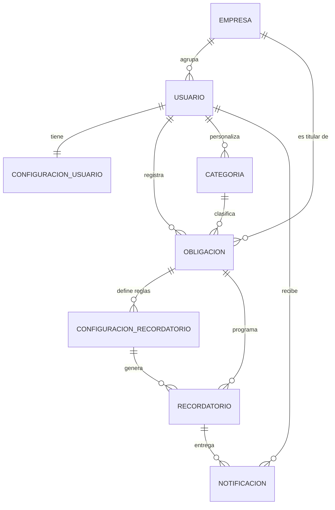

# PAYRECORD — Modelo de datos

Estado real de la base de datos al cierre de la fase 12. Contrastado con las
migraciones aplicadas, no con la propuesta inicial.

---

## 1. Diagrama entidad-relación



**Ocho tablas de negocio.** No existe tabla de estados (se derivan), ni de
prioridades (son un enum), ni de proveedores (ver decisión D4 más abajo).

---

## 2. Tablas

### 2.1 `usuarios_empresa`

| Campo | Tipo | Notas |
|---|---|---|
| `id` | BIGINT PK | |
| `nombre` | VARCHAR(150) | Razón social |
| `nit` | VARCHAR(30) | Único, admite nulo |
| `telefono` | VARCHAR(30) | |
| `activa` | BOOLEAN | |
| `creado_en`, `actualizado_en` | DATETIME | De `ModeloBase` |

### 2.2 `usuarios_usuario`

Modelo de autenticación (`AUTH_USER_MODEL`). Se identifica por correo: no
tiene campo `username`.

| Campo | Tipo | Notas |
|---|---|---|
| `id` | BIGINT PK | |
| `email` | VARCHAR(254) | **Único.** `USERNAME_FIELD` |
| `password` | VARCHAR(128) | Hash PBKDF2. Nunca texto plano |
| `nombre` | VARCHAR(150) | |
| `tipo_usuario` | VARCHAR(10) | `PERSONAL` \| `EMPRESA` |
| `empresa_id` | FK → empresa | Nulo en cuentas personales. `PROTECT` |
| `is_active` | BOOLEAN | El administrador activa y desactiva cuentas |
| `is_staff`, `is_superuser` | BOOLEAN | Rol administrativo (§27) |
| `date_joined`, `last_login` | DATETIME | |

### 2.3 `usuarios_configuracionusuario`

Relación 1:1 con el usuario. Se crea automáticamente por señal `post_save`,
de modo que también la reciben los usuarios creados con `createsuperuser`.

| Campo | Tipo | Notas |
|---|---|---|
| `usuario_id` | FK 1:1 | `CASCADE` |
| `dias_proximo_vencimiento` | SMALLINT | Umbral de «próxima a vencer». Por defecto 7 |
| `dias_recordatorio_default` | JSON | Días propuestos al crear una obligación |
| `notificaciones_app` | BOOLEAN | |
| `notificaciones_email` | BOOLEAN | Reservado para la fase 7b |

Se separa del usuario para no engordar la tabla de autenticación y porque
estas preferencias crecerán cuando se implemente §20.

### 2.4 `obligaciones_categoria`

| Campo | Tipo | Notas |
|---|---|---|
| `nombre` | VARCHAR(80) | |
| `codigo` | SLUG(60) | **Único.** Solo en las predeterminadas; nulo en las del usuario |
| `ambito` | VARCHAR(10) | `PERSONAL` \| `EMPRESA` \| `AMBOS` |
| `usuario_id` | FK, nulo | **Nulo = categoría del sistema.** `CASCADE` |
| `color`, `icono` | VARCHAR | Presentación |
| `peso_prioridad` | SMALLINT | 0 a 5. Alimenta el algoritmo de §12 |
| `activa` | BOOLEAN | Se desactiva en vez de borrar |

**Restricción:** `UNIQUE(usuario, nombre)`. Las predeterminadas se protegen
con `codigo` único, porque en MySQL varios `NULL` no colisionan en un índice
único.

El catálogo son **13 filas**. Las listas de §8 suman 17 entradas, pero
Servicios, Créditos, Impuestos y Otros aparecen en ambas y se guardan una
sola vez con ámbito `AMBOS`.

### 2.5 `obligaciones_obligacion`

La entidad central.

| Campo | Tipo | Notas |
|---|---|---|
| `usuario_id` | FK | Quién la creó. `CASCADE` |
| `empresa_id` | FK, nulo | Se copia del usuario al guardar. `PROTECT` |
| `concepto` | VARCHAR(150) | |
| `descripcion` | TEXT | Opcional |
| `monto` | DECIMAL(14,2) | **Nunca float.** Validador de mínimo 0.01 |
| `fecha_vencimiento` | DATE | Fecha, no instante: evita líos de zona horaria |
| `categoria_id` | FK | `PROTECT`: no se borra una categoría con obligaciones |
| `enlace_pago` | URL(500) | Opcional. PAYRECORD no procesa pagos |
| `prioridad_usuario` | VARCHAR(6) | `BAJA` \| `MEDIA` \| `ALTA` |
| `pagada` | BOOLEAN | **Fuente de verdad del estado** |
| `fecha_pago` | DATE, nulo | |
| `proveedor` | VARCHAR(150) | Solo cuentas de empresa |
| `referencia` | VARCHAR(80) | Número de factura o documento |
| `eliminada_en` | DATETIME, nulo | **Borrado lógico** (decisión D7) |

**Índices:** `(usuario, fecha_vencimiento)`, `(empresa, fecha_vencimiento)`,
`(pagada, fecha_vencimiento)`.

**No hay campo `estado`.** Se deriva de `pagada`, `fecha_pago` y
`fecha_vencimiento` (ver sección 4).

### 2.6 `recordatorios_configuracionrecordatorio`

La **regla**: «avísame N días antes por este canal».

| Campo | Tipo | Notas |
|---|---|---|
| `obligacion_id` | FK | `CASCADE` |
| `dias_antes` | SMALLINT | 0 = el día del vencimiento |
| `canal` | VARCHAR(10) | `APP` \| `EMAIL` |
| `activa` | BOOLEAN | Desmarcar desactiva, no borra |

**Restricción:** `UNIQUE(obligacion, dias_antes, canal)`.

### 2.7 `recordatorios_recordatorio`

La **instancia**: esa regla aplicada a una fecha concreta.

| Campo | Tipo | Notas |
|---|---|---|
| `obligacion_id` | FK | `CASCADE` |
| `regla_id` | FK, nulo | `SET_NULL`: el histórico sobrevive a la regla |
| `dias_antes` | SMALLINT | Copiado de la regla |
| `fecha_programada` | DATE | `fecha_vencimiento − dias_antes` |
| `canal` | VARCHAR(10) | |
| `estado` | VARCHAR(10) | `PENDIENTE` \| `ENVIADO` \| `CANCELADO` \| `ERROR` |
| `fecha_envio` | DATETIME, nulo | |
| `detalle_error` | TEXT | |

**Restricción crítica:** `UNIQUE(obligacion, dias_antes, fecha_programada, canal)`.

Esta constraint **es** la garantía de idempotencia de §15. No hay un `if not
exists` en Python que pudiera sufrir una condición de carrera si el proceso
corre dos veces a la vez: la base de datos rechaza el duplicado.

### 2.8 `recordatorios_notificacion`

La **entrega** al usuario.

| Campo | Tipo | Notas |
|---|---|---|
| `usuario_id` | FK | `CASCADE` |
| `recordatorio_id` | FK, nulo | `SET_NULL` |
| `titulo`, `mensaje` | VARCHAR / TEXT | |
| `url_destino` | VARCHAR(255) | |
| `leida` | BOOLEAN | |
| `fecha_lectura` | DATETIME, nulo | **Insumo de §20** |

**Índice:** `(usuario, leida)`, que es la consulta del contador del menú.

---

## 3. Propiedad de los datos y aislamiento

Toda consulta de obligaciones pasa por un único punto:

```python
Obligacion.objects.visibles_para(usuario)
#   obligacion.usuario == usuario
#   OR (usuario.empresa IS NOT NULL AND obligacion.empresa == usuario.empresa)
```

Ninguna vista usa `get_object_or_404(Obligacion, pk=pk)` sin ese filtro.
Todas heredan de `ObligacionQuerysetMixin`, y una prueba de barrido recorre
las rutas registradas comprobando que ninguna privada responde a un anónimo.

Hoy, con un usuario por empresa, ambas condiciones coinciden. Cuando una
empresa tenga varios usuarios (§26), seguirá siendo correcto sin tocar
ninguna vista: basta crear el usuario con `empresa=X`. Hay una prueba que lo
verifica con dos usuarios de la misma empresa.

---

## 4. El estado es derivado, no almacenado

Decisión **D3**. La fuente de verdad son tres campos; el estado se calcula
por dos caminos equivalentes:

```
si pagada                          -> PAGADA
si fecha_vencimiento < hoy         -> VENCIDA
si fecha_vencimiento <= hoy+umbral -> PROXIMA_VENCER
en otro caso                       -> PENDIENTE
```

| Camino | Dónde | Para qué |
|---|---|---|
| `calcular_estado()` | `services/estados.py`, Python puro | Una obligación suelta |
| `anotacion_estado()` | `Case/When` en SQL | Listados: permite filtrar y ordenar |

Existe una prueba que ejecuta ambos sobre el mismo conjunto y compara caso
por caso: si alguien modifica uno y olvida el otro, la suite falla.

**Por qué no se persiste:** un campo `estado` guardado queda mal en cuanto
pasa la medianoche y hasta que corra el proceso que lo actualice. §9 pide
explícitamente que el usuario no tenga que actualizar el estado a mano.

El umbral de «próxima a vencer» es por usuario
(`ConfiguracionUsuario.dias_proximo_vencimiento`), no una constante.

---

## 5. Decisiones que explican la forma del modelo

| # | Decisión | Efecto en el modelo |
|---|---|---|
| D1 | Propiedad `usuario` + `empresa` | Dos FK en `Obligacion` en lugar de una |
| D3 | Estado derivado | **No existe** columna `estado` |
| D4 | Proveedor como texto | **No existe** tabla `Proveedor` |
| D5 | Recordatorios en tres niveles | Tres tablas en vez de una |
| D7 | Borrado lógico | Campo `eliminada_en` en vez de `DELETE` |
| D9 | Catálogo global + personalizadas | `Categoria.usuario` admite nulo |

### Sobre D4, reevaluada en la fase 9

Se mantuvo el campo de texto. Una tabla `Proveedor` añadiría un CRUD y una
relación para un dato que no tiene atributos propios: hoy solo se usa para
agrupar. La fragilidad del texto libre se atacó por dos vías: `normalizar()`
reutiliza la grafía que el usuario ya empleó («claro» junto a un «Claro»
existente se guarda como «Claro») y el formulario ofrece los proveedores
anteriores como sugerencias.

Si más adelante hicieran falta NIT, contacto o condiciones de pago del
proveedor, entonces sí corresponde crear la tabla.

---

## 6. Integridad referencial

| Relación | `on_delete` | Motivo |
|---|---|---|
| `Obligacion.categoria` | `PROTECT` | Borrar una categoría con obligaciones destruiría el historial |
| `Obligacion.empresa` | `PROTECT` | Igual |
| `Usuario.empresa` | `PROTECT` | Una empresa con usuarios no se borra sin más |
| `Obligacion.usuario` | `CASCADE` | Si se borra la cuenta, se van sus datos |
| `Categoria.usuario` | `CASCADE` | Las personalizadas mueren con su dueño |
| `Recordatorio.regla` | `SET_NULL` | El histórico sobrevive a la regla que lo originó |
| `Notificacion.recordatorio` | `SET_NULL` | Igual |

La vista de borrado de categorías captura `ProtectedError` y **degrada a
desactivación** en lugar de mostrar un error: el usuario quería quitarla de
en medio, no romper sus estadísticas.

---

## 7. Codificación y tipos

- Base de datos en `utf8mb4` / `utf8mb4_unicode_ci`: admite tildes, ñ y
  emojis sin corrupción.
- `sql_mode = STRICT_TRANS_TABLES`: MySQL rechaza datos que no caben en la
  columna en lugar de truncarlos en silencio.
- Dinero en `DecimalField(14,2)`. **Nunca `float`**: los errores de redondeo
  en una aplicación financiera son inaceptables.
- Fechas de vencimiento en `DateField`, no `DateTimeField`. Un vencimiento
  es un día, no un instante, y así se evitan errores de borde con la zona
  horaria. «Hoy» se obtiene siempre con `timezone.localdate()` en
  `America/Bogota`.
